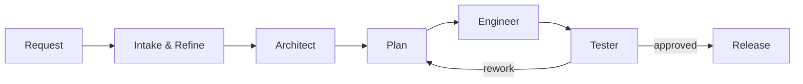

<p align="center">
  
</p>

<h1 align="center"><b>Gaia</b></h1>
<h3 align="center">full-stack apps. enterprise-grade. maintainable. customizable.</h3>
<p align="center"><i>Designed to be installed as a GitHub Copilot plugin</i></p>

---

[]()
[](https://opensource.org/licenses/MIT)
[]()
[]()
[]()

---

## What is Gaia?

Gaia is a **team of AI agents** designed to build and evolve software using **spec-driven development**.
You describe your goal; Gaia coordinates architecture, implementation, testing, documentation and so on.

---

## Install the Gaia plugin locally
> This can be done after any changes to this repo / system in order to continuously have the latest version of the Gaia system installed globally.

`copilot plugin install ./` *note: the absolute path to the plugin should be used here.*

---

## How Gaia Works (Adaptive Spec-Driven SDLC)

- `docs/` is the **source of truth** for requirements and architecture.
- **No drift**:
  - If a spec describes a feature, it must exist in code.
  - If code changes behavior, the spec must be updated.
- New work starts with **intake-led refinement** and **solutions architecture**, not direct coding.
- Gaia adapts the SDLC to the **complexity of the task**, but always keeps architecture review, planning, QA, and release validation in the loop.
- Gaia assembles a **virtual team on the fly**: intake orchestrator, solutions architect, implementation planner, software engineer, tester, and release engineer.
- Each agent should get only the tools required for its role so read-only analysis stays read-only and delivery ownership stays clear.
- Agents may call each other directly when prerequisites are satisfied, and the plan should expose safe parallel branches instead of forcing unnecessary serialization.
- Planning happens **after architecture** so the execution tree reflects the target solution, estimates, dependencies, QA work, and CI or deployment gates.
- QA is always present in the process and can veto weak completion claims.



**Virtual team:**

- Intake orchestrator owns intake, refinement, complexity classification, and the initial graph.
- Solutions architect owns `docs/` and architecture decisions.
- Implementation planner creates the branch-aware execution tree in `gaia_plan.md`.
- Software engineer owns implementation and stabilization.
- Tester validates behavior, regression risk, and quality gates continuously.
- Release engineer validates CI and delivery gates.

Shared workflow policy lives in **`AGENTS.md`** so agent files can stay role-specific without repeating the entire contract.

The workflow contract lives in **`AGENTS.md`**.

---

## Using Gaia

### In VS Code (recommended)

1. Open your project folder in VS Code
2. Enable GitHub Copilot
3. Start a chat and describe what you want

### In the Terminal (Copilot CLI)

```bash
npm i -g @github/copilot && copilot -p "<your project request>" --yolo
```

Example:

```bash
copilot -p "Create a REST API for a blog with posts and comments"  --yolo
```

---

### Advanced Mode
The below may be used to simulate a workflow execution by running copilot cli in headless mode.

*Basic chaining for workflows*
```bash
copilot -p "prompt 1" --yolo && copilot -p "prompt 2" --yolo && copilot -p "prompt 3" --yolo
```

*Recursive chaining for continuous workflows*
```bash
while true; do copilot -p "prompt 1" --yolo && copilot -p "prompt 2" --yolo && copilot -p "prompt 3" --yolo; done
```

---

## Disclaimers
Note that the current configuration for the usage of Gaia's MCP server, is remote. This means your data will safely live on the Gaia secure server.

*What gets stored*
- Self-improvement requests that Gaia automatically logs when struggling with a given problem. This helps us auto-improve Gaia on the backend as new "issues" with the Gaia process gets logged by you fine folks. In turn we push a new optimized version of Gaia for free to everyone. An improved one.
- Task items for Gaia plans. This is merely a persistent tracking mechanism for your Gaia to stay anchored. Because this is a remote MCP, it works perfectly in the GitHub Copilot web (coding agent), for a completely hands-off approach. All tasks are segregated by project name to ensure no overlap.
- Memory items for Gaia for the project, like the above, is securely persisted so you can access your project memories (and tasks), from remote sources and effortlessly switch between them. Even have them run in parallel to pick up different tasks.

*What doesn't get stored*
- Any user PII
- Actual project code
- System and test specs (or any documentation)

**If you prefer not to take advantage of the Gaia remote MCP, feel free to configure the MCP server (here locally) to use STDIO instead of HTTP and configure your MCP configs to point to that instead, for a completely local experience.**

---

<p align="center">
  <i>"In Greek mythology, Gaia is the personification of Earth and the ancestral mother of all life."</i>
</p>
